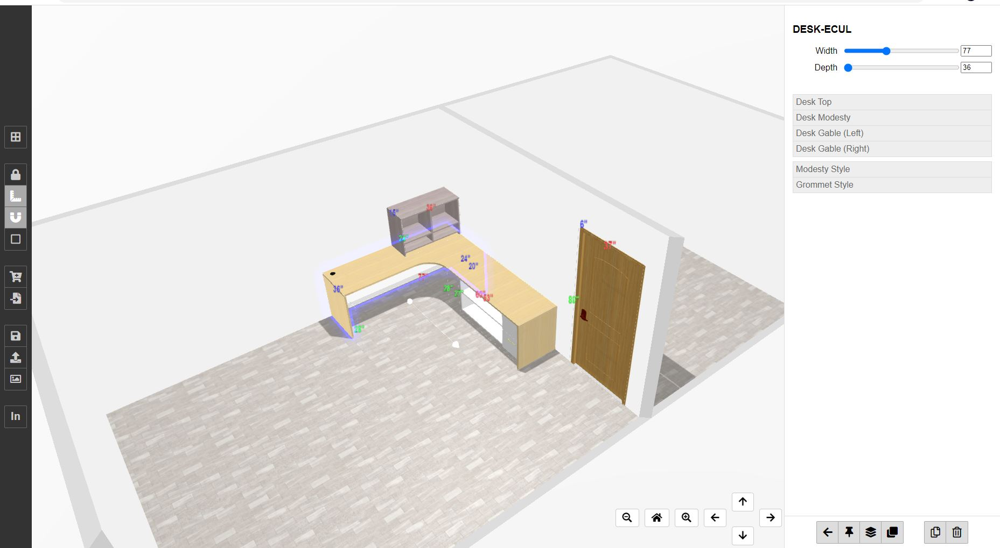
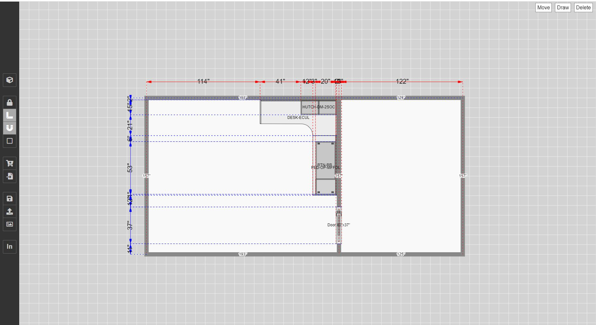

# Three.js-based room configurator (floor planner + product configurator)
## Note: Current version is react-bundled one, please contact me via telegram (@pegasus_0000)
[Live](https://threejs-room-configurator.netlify.app/)

### Features
#### 1. FloorPlan Design

Users can edit floorplan in 2d view mode.
There users can move/draw/delete walls & corners by mouse to design floor plan.

#### 2. Room Configuration

Users can add products(models) from product list.
And change their position, orientation.
This can be handled on not only 3d view but also 2d view.
#### 3. Product Configuration

Once users select product, users can change the configuration of selected product directly.

**Configuration Properties**
* **Dimensions** (It isn't just scaling, it uses morph internally)
* **Materials** (Separate parts of model can have different textures)
* **Styles** (Product may have different styles and one of them may be selected)

*All of these properties should be defined when design models*
